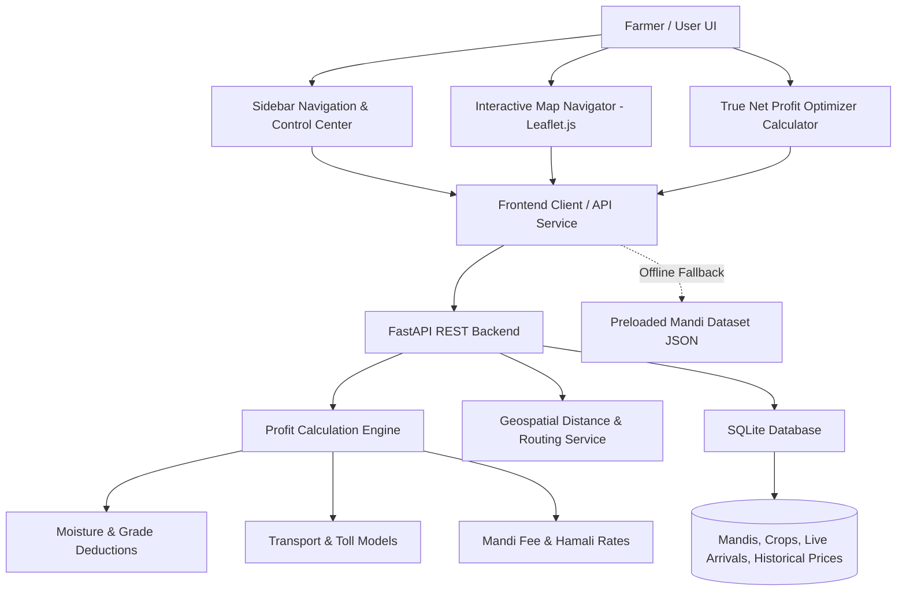

# KisanMarg (किसानमार्ग) - Smart Mandi Intelligence & Net Profit Navigator
### End-to-End AgriTech Solution for Kalpvruksh 2.0 Hackathon Problem P22

## Problem Analysis & Core Value Proposition

The official problem statement (**P22: Limited Visibility Into Profitable Grain Market Choices**) highlights critical pain points faced by agricultural producers:
1. **Misleading Quoted Prices vs. Real Take-Home Profit**: A mandi quoting ₹2,550/quintal 60 km away often yields less cash than a local mandi quoting ₹2,420/quintal once transport (fuel, vehicle hiring), loading/unloading (hamali), mandi cess/brokerage, overnight waiting time, and moisture/foreign matter dockages are subtracted.
2. **Unit & Quality Incompatibilities**: Prices are published in varying units (quintals, maunds, 50kg bags) or reflect generic averages rather than the farmer's specific harvest quality (moisture %, grain test weight, FAQ vs Non-FAQ).
3. **Queue & Congestion Blindspots**: Farmers make transit decisions blind to real-time mandi arrivals and gate traffic. Long unloading queues risk quality deterioration, overnight lodging expenses, or forced distress sales at the gate.
4. **Urgent Cash Needs & Middleman Exploitation**: Information asymmetry benefits middlemen. Farmers needing immediate liquidity often sell at a steep discount without knowing nearby warehouse receipt financing options.

**KisanMarg** directly eliminates these asymmetries through an intelligent, farmer-first web application featuring an interactive map, dynamic net-profit calculation engine, and full sidebar feature suite.

---

## User Review Required

> [!IMPORTANT]
> - **Backend & Runtime Choice**: We will provide a modern Python backend using **FastAPI** (already installed in the environment) alongside an offline-first **Fallback Mock Service** directly embedded in the frontend. This guarantees that judges and reviewers can run the application either with `python backend/app.py` or by simply opening `frontend/index.html` in any browser with zero setup.
> - **Interactive Map Technology**: We will use **Leaflet.js** with OpenStreetMap tiles (no paid API key required, 100% free and open-source) with customizable mandi pins, profit heat indicators, and distance isochrones.

---

## Architecture & System Design



---

## Proposed Project Structure

We will create clean, modular directories and files inside `c:\Users\h6979\OneDrive\Desktop\hackathon`:

```
hackathon/
├── .gitignore                     # Git exclusion rules for Python, cache, and IDE files
├── README.md                      # Comprehensive documentation, architecture & run instructions
│
├── frontend/                      # User Interface & Farmer Dashboard
│   ├── index.html                 # Complete responsive single-page web application
│   ├── styles.css                 # Modern CSS (Dark/Light mode, Glassmorphism, Responsive design)
│   ├── app.js                     # Main application logic, state manager, and tab router
│   ├── components/
│   │   ├── sidebar.js             # Sidebar state controller with feature switching
│   │   ├── map.js                 # Interactive Leaflet map, GPS locator, radius filters & pins
│   │   ├── profit_calculator.js   # Dynamic take-home profit & comparison table
│   │   ├── queue_tracker.js       # Live mandi arrival volume & waiting time index
│   │   ├── trends_view.js         # 14-day price trend graphs & APMC MSP benchmarks
│   │   └── distress_advisor.js    # Urgent cash vs warehouse receipt (e-NWR) advisor
│   └── data/
│       └── mandis_fallback.json   # Zero-config bundled dataset for immediate demo
│
├── backend/                       # Python FastAPI Backend
│   ├── app.py                     # Main FastAPI server with CORS & lifecycle management
│   ├── requirements.txt           # Python dependency specifications
│   ├── logic/
│   │   ├── __init__.py
│   │   ├── profit_engine.py       # Math engine for deductions, logistics, net take-home
│   │   ├── geospatial.py          # Haversine distance, travel time & road detour factor
│   │   └── grade_dockage.py       # Moisture cut, foreign matter, and APMC grade deductions
│   └── models/
│       ├── __init__.py
│       └── schemas.py             # Pydantic data schemas for requests/responses
│
├── database/                      # Data Storage & Seeds
│   ├── db.py                      # SQLite database initialization & querying interface
│   ├── schema.sql                 # SQL schema: mandis, crops, daily_prices, live_queues
│   ├── seed.py                    # Script populating 25+ realistic APMC mandis across key grain hubs
│   └── mandi_data.sqlite          # Lightweight portable SQLite database
│
└── api/                           # API Specifications & Contracts
    ├── openapi.json               # Full OpenAPI 3.0 specification
    ├── endpoints.md               # API route catalog & sample curl requests
    └── client.js                  # Clean API client wrapper with automatic fallback
```

---

## Proposed Changes & File Specifications

### 1. Root Configurations & Documentation
#### [NEW] [.gitignore](file:///c:/Users/h6979/OneDrive/Desktop/hackathon/.gitignore)
- Ignore `__pycache__`, `*.pyc`, `*.sqlite`, `.env`, `.vscode`, `.idea`, OS temporary files.

#### [NEW] [README.md](file:///c:/Users/h6979/OneDrive/Desktop/hackathon/README.md)
- Complete hackathon dossier overview: Problem P22 breakdown, solution architecture, formula for Net Profit Calculation, feature directory, quickstart guide (frontend-only and full-stack backend).

---

### 2. Frontend Layer (`frontend/`)

#### [NEW] [index.html](file:///c:/Users/h6979/OneDrive/Desktop/hackathon/frontend/index.html)
- Clean, semantic HTML5 structure.
- **Sidebar Menu**:
  1. 🗺️ **Mandi Explorer & Map**: Interactive geographic exploration of nearby grain markets.
  2. 🧮 **Net Profit Calculator**: Compare actual take-home earnings across all mandis.
  3. 🌾 **Grade & Moisture Dockage**: Unit converter (Quintal/Maund/Bag) & moisture cut analyzer.
  4. ⏱️ **Live Gate & Queue Tracker**: Real-time arrival truck counts and wait-time estimations.
  5. 📊 **Price Trends & MSP Signals**: 14-day price trajectory vs Government MSP.
  6. 🤝 **Verified Buyers & Direct FPOs**: Direct purchasing agents & bypass commission fees.
  7. 🚨 **Distress Sale & Loan Advisor**: Immediate cash need navigator (local distress vs e-NWR warehouse loan).
- **Top Navigation**: Farmer location selector, quick radius slider (10km - 150km), search bar, language toggle (English / हिंदी), and live market status badge.
- **Map View Container**: Full-screen or dual-pane Leaflet map container with custom pin legend and quick detail modal.

#### [NEW] [styles.css](file:///c:/Users/h6979/OneDrive/Desktop/hackathon/frontend/styles.css)
- Rich modern aesthetics: Emerald/Teal agricultural theme (`#0f5132`, `#10b981`, `#047857`), clean typography (Inter / Outfit), glassmorphism cards, interactive badges, responsive layout for mobile and desktop.

#### [NEW] [app.js](file:///c:/Users/h6979/OneDrive/Desktop/hackathon/frontend/app.js) & Component Modules
- **`app.js`**: App initialization, sidebar navigation, data fetching, global state.
- **`components/map.js`**: Leaflet map setup, custom SVG pins (Green = Max Profit, Yellow = Medium, Red = Unprofitable Logistics), popup cards with route info.
- **`components/profit_calculator.js`**: Real-time recalculation as user tweaks quantity, crop moisture (e.g. 12% to 19%), vehicle hiring cost, and hamali rates.
- **`components/queue_tracker.js`**: Arrival volume graphs, gate delay risk index, unloading turnaround time.
- **`components/trends_view.js`**: Price fluctuation chart comparing nearby mandis.
- **`components/distress_advisor.js`**: Cash-need decision matrix.

---

### 3. Backend Layer (`backend/`)

#### [NEW] [app.py](file:///c:/Users/h6979/OneDrive/Desktop/hackathon/backend/app.py)
- FastAPI application with CORS middleware, health check, and endpoints:
  - `GET /api/mandis`: List mandis with filters for crop, distance radius, and coordinates.
  - `POST /api/calculate-net-profit`: Computes real net take-home profit for all mandis given farmer's location, crop type, quantity, moisture, and vehicle type.
  - `GET /api/crops`: List supported grains (Wheat, Basmati Paddy, Non-Basmati Paddy, Mustard, Soyabean, Maize, Gram/Chana).
  - `GET /api/queues`: Live truck arrival counts, gate congestion, wait time.
  - `GET /api/trends/{mandi_id}/{crop_id}`: Historical 14-day modal price trend vs MSP.
  - `GET /api/warehouses`: Nearby accredited warehouses offering pledge loans.

#### [NEW] [logic/profit_engine.py](file:///c:/Users/h6979/OneDrive/Desktop/hackathon/backend/logic/profit_engine.py)
- Mathematical formulation:
  $$\text{Deducted Qty} = \text{Gross Qty} \times \left(1 - \max\left(0, \frac{\text{Moisture} - \text{Base Moisture}}{100}\right) \times \text{Dockage Rate}\right)$$
  $$\text{Gross Revenue} = \text{Deducted Qty} \times \text{Mandi Rate}$$
  $$\text{Logistics Cost} = (\text{Distance} \times 2 \times \text{Per-Km Rate}) + \text{Tolls}$$
  $$\text{Handling Cost} = \text{Gross Qty} \times (\text{Hamali Rate} + \text{Weighment Fee})$$
  $$\text{Mandi Charges} = \text{Gross Revenue} \times (\text{APMC Cess} + \text{Trader Commission})$$
  $$\text{Wait Cost} = \text{Queue Hours} \times \text{Driver Detaining Cost/Hr}$$
  $$\mathbf{\text{Net Take-Home}} = \text{Gross Revenue} - (\text{Logistics} + \text{Handling} + \text{Mandi Charges} + \text{Wait Cost})$$

#### [NEW] [logic/geospatial.py](file:///c:/Users/h6979/OneDrive/Desktop/hackathon/backend/logic/geospatial.py)
- Haversine distance formula with road winding factor (1.25x) to approximate realistic transit distances and travel hours.

---

### 4. Database Layer (`database/`)

#### [NEW] [schema.sql](file:///c:/Users/h6979/OneDrive/Desktop/hackathon/database/schema.sql)
- Tables:
  - `mandis`: APMC ID, name, district, state, latitude, longitude, contact, average wait hours.
  - `crops`: Crop ID, name, category, standard MSP (2025-26), standard moisture threshold (e.g. 14%).
  - `daily_prices`: Mandi ID, Crop ID, date, min price, max price, modal price, arrival tonnes.
  - `mandi_fees`: APMC tax %, commission %, hamali charge per quintal.
  - `warehouses`: WDRA accredited warehouses with pledge finance options.

#### [NEW] [db.py](file:///c:/Users/h6979/OneDrive/Desktop/hackathon/database/db.py) & [seed.py](file:///c:/Users/h6979/OneDrive/Desktop/hackathon/database/seed.py)
- Connects to SQLite and seeds comprehensive, realistic grain mandis (e.g., Khanna, Karnal, Indore, Kota, Rajkot, Ganganagar, Nizamabad, Sehore) across major grain producing belts with realistic market dynamics.

---

### 5. API Layer (`api/`)

#### [NEW] [openapi.json](file:///c:/Users/h6979/OneDrive/Desktop/hackathon/api/openapi.json)
- Full OpenAPI 3.0 specification for all REST endpoints, schemas, and error codes.

#### [NEW] [endpoints.md](file:///c:/Users/h6979/OneDrive/Desktop/hackathon/api/endpoints.md)
- Markdown documentation of each API endpoint with example inputs and outputs.

#### [NEW] [client.js](file:///c:/Users/h6979/OneDrive/Desktop/hackathon/api/client.js)
- Unified API client that automatically uses the live FastAPI backend if reachable, or gracefully falls back to client-side offline calculation engine so the web solution works anywhere, anytime.

---

## Verification Plan

### Automated Verification
1. **Database & Seeding**:
   - Run `python database/seed.py` and verify SQLite tables and records are created successfully.
2. **Backend API Verification**:
   - Start backend using `python backend/app.py` or `python -m uvicorn backend.app:app --port 8000`.
   - Test endpoints (`/api/mandis`, `/api/calculate-net-profit`, `/api/crops`) via HTTP requests.
3. **Calculation Engine Accuracy**:
   - Verify that when moisture exceeds baseline, dockage reduces payable quintals accurately.
   - Verify that a farther mandi with a higher price can rank lower in net profit than a closer mandi with lower price.

### Manual & Interactive Browser Verification
1. Open `frontend/index.html` in the browser.
2. Test **Sidebar Feature Navigation**: Click through all 7 sidebar views (Map, Calculator, Grade & Moisture, Queue Tracker, Price Trends, Buyer Directory, Distress Advisor) and verify smooth transitions.
3. Test **Interactive Map**:
   - Verify Leaflet map loads with custom pins.
   - Click a mandi pin to open popup with details and "Compare Net Profit" action.
   - Move radius slider (25km -> 100km) and verify pins update.
4. Test **Net Profit Calculator**:
   - Change crop (e.g., Wheat to Basmati Paddy).
   - Change quantity (50 quintals to 200 quintals).
   - Change moisture (12% to 18%) and observe immediate real-time ranking shift.
5. Test **Offline Fallback**: Ensure the web app continues to function seamlessly even if the backend is not running.
